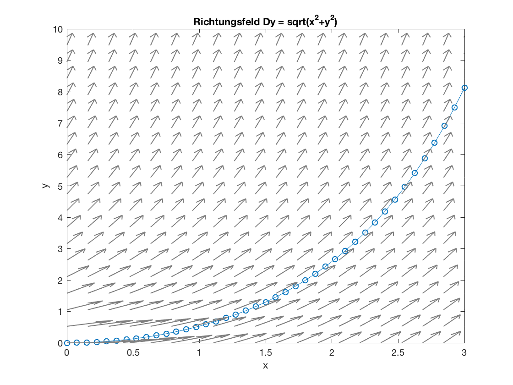

# Differenzialgleichungen
Hans W Borchers  
10/27/2016  

## Einführung DGL

Das Lösen von Differentialgleichungen und Anfangswertproblemen ist eine der zentralen Aufgabenstellungen der Ingenieurmathematik.

Eine (gewöhnliche) *Differentialgleichung* (DGL) erster Ordnung ist ein Ausdruck der Form
$$
  y' = \frac{\mathrm{d}y}{\mathrm{d}x} = f(x, y), \quad y(a) = y_0
$$
Die rechte Seite ist hierbei eine Funktion $f$ in zwei Variablen $x$ und $y$. Links steht explizit die Ableitung von $y$ nach $x$. Dies ist keine explizite Gleichung, sondern eher eine Problembeschreibung: 

Gesucht ist eine Funktion $y = y(x)$, welche in einem Intervall $[a, b]$ definiert ist und die *Anfangsbedingung* $y(a) = y_0$ erfüllt.

Erste Ordnung bedeutet hierbei, dass die erste Ableitung die höchste vorkommende Ableitung ist. Und 'gewöhnlich' bedeutet, dass nur Funktionen einer Veränderlichen betrachtet werden.

**Beispiel**: Eine DGL der Form $y' = f(x)$ ($f$ nur von $x$ abhängig) hat die offensichtliche Lösung
$y(x) = \int_a^x f(t) \mathrm{d}t = F(t)|_a^x$
wenn die *Stammfunktion* $F$ von $f$ bekannt ist.

In den Mathematik-Vorlesungen werden verschiedene Methoden zur expliziten Lösung von Differenzialgleichungen vorgestellt. Der einfachste und wichtigste Fall ist vielleicht $y' = k \, y$. Für $k < 0$ beschreibt dies *Zerfallsprozesse*, für $k > 0$ *Wachstumsprozesse*, zum Beispiel Zinseszins-Aufgaben.

**Aufgabe**: 

Oft ist es schwierig, die theoretische Lösung einer Differenzialgleichung zu finden. In vielen Fällen gibt es auch keine explizite Lösung, ähnlich wie für Integrale nicht immer eine explizite Stammfunktion gibt.

Wir sind deshalb an numerischen Verfahren zur Lösung von Differenzialgleichungen interessiert. Zum besseren Verständnis behandeln wir das *Richtungsfeld*, es dient der zeichnerischen Bestimmung einer Näherungslösung einer Differentialgleichung.

Die in der Differenzialgleichung auftretende Funktion $f$ ist auf einem Teil der x-y-Ebene gegeben und definiert dort in jedem Punkt die Steigung einer möglichen Lösung durch diesen Punkt. Die für diesen Kurs erstellte Funktion `richtungsfeld` zeichnet diese Steigungen als Pfeile in einem vorgegebenen rechteckigen Bereich.

    >> df = @(x, y) sqrt(x.^2 + y.^2)
    >> ode45(df, [0, 3], 0)
    >> hold on
    >> richtungsfeld(df, [0, 3], [0, 10], 20)
    >> hold off

Das Richtungsfeld veranschaulicht die Ableitungen der Differenzialgleichung $y' = \sqrt{x^2 + y^2}$ und enthält auch den Funktionsgraphen einer Lösung, mit dem Anfangswert $y(0) = 0$.



## Eulers Polygonzug-Verfahren

Ein Anfangswertproblem ist eine Differentialgleichung plus eine Anfangsbedingungen. Gesucht ist die Funktion $y$ in Abhängigkeit von $x$. Unter gewissen Bedingungen an die Funktion $f$ existiert eine Lösung und ist eindeutig.

Die Idee des Eulerschen Verfahrens ist einfach. Gegeben ein Lösungskurve in einem Punkt $x$, dann gilt offenbar für eine kleine Schrittweite $h$
$$
  y(x+h) \approx y(x) + h \cdot y'(x) = y(x) + h \cdot f(x, y(x))
$$
Zusammen mit der Anfangsbedingung liefert und das für äquidistante Punkte Näherungswerte $y_k$ an den Stellen $x_k$ gemäß dieser Vorschrift. Dieses als *explizites Euler-Verfahren* bekannte Vorgehen ist in der folgenden Funktion implementiert.

```matlab
function [x, y] = euler(df, a, b, y0, n)
% Euler Verfahren mit Heun Korrektur
h = (b-a)/n;
x = a:h:b;
y = zeros(1, n+1);
y(1) = y0 ;
for k = 2:n+1
    y(k) = y(k-1) + h * f(x(k-1), y(k-1));
    y(k) = y(k-1) + h * (f(x(k-1), y(k-1)) + f(x(k), y(k))) / 2;
end
end
```

Dabei ist `df` eine Funktion von `x` und `y`, welche die Differenzialgleichung $y' = f(x, y)$ repräsentiert, `[a, b]` das Intervall, in dem eine Lösung gesucht wird, `y0` der Anfangswert in `a`, und `n` die Anzahl der Schritte bzw. `(b-a)/n` die Schrittweite.

Hier ist schon die Euler-Heun Korrektur mit eingearbeitet: Die Steigung im Punkt $x_{k-1}$ wird noch mit der Steigung im neu berechneten Punkt $x_k$ gemittelt, um die Abweichung von der realen Lösung noch kleiner zu halten.

Statt einer analytischen erhalten wir eine numerische Lösung, nämlich in `x` und `y` die x- und y-Koordinaten von Punkten auf der Lösungskurve. Mit `plot(x, y, 'o-')` können die Kurve und die berechneten Punkte geplottet werden.

**Aufgabe**: Löse die Differenzialgleichung $y' = x + y$ im Intervall $[0, 1]$ mit Anfangsbedingung $y(0) = 0$ mit dem Euler-Verfahren und vergleiche dies mit der analytischen Lösung $y(x) = e^x - x - 1$ graphisch sowie die Endwerte in $b = 1$. Wie gross ist die Abweichung, mit und ohne Heun-Korrektur?


## DGL Löser in MATLAB

Es gibt in MATLAB für das Lösen von Differenzialgleichungen und Anfangswertproblemen vorgefertigte Lösungsverfahren. Diese nennt man ODE-Solver (ODE für engl. *ordinary differential equation*) oder -Löser. Es gibt sogar eine eher verwirrende Vielfalt von solchen Solvern, angepasst an verschiedene Gleichungstypen.

Der wohl am meisten verwendete ODE-Solver ist `ode45`. Dieser Löser implementiert eine Variante des *Runge-Kutta-Verfahrens* und ist für die häufig auftretenden Differentialgleichungen gut geeignet. Die '4' und '5' stehen für Approximationen 4-ter Ordnung an die Funktion und Fehlerterme 5-ter Ordnung. (So gibt es zum Beispiel auch einen Löser `ode23`.)

Der Aufruf des Befehls `ode45` erfolgt ähnlich wie der unserer oben erstellten Funktion `euler`. Tatsächlich könnte man `euler` auch als einen Solver bezeichnen. Nur dass `ode45` durch ein bessere Annäherung an die Funktion und durch angepasste (nicht gleichmässige) Schrittweiten eine weitaus höhere Genauigkeit erreichen kann.

Die rechte Seite der Differentialgleichung $y' = f(x, y)$ muss zunächst als MATLAB Funktion definiert werden, als *anonyme Funktion* (mit Klammeraffe `@`) oder in einer m-Datei. Diese Funktion muss als erstes angegeben werden, als zweites der Zeitraum oder Bereich, in dem `y(x)` berechnet werden soll -- als Intervall! Dahinter der Startwert im Anfangspunkt des Intervalls. Diese drei Angaben sind immer notwendig.

Lösen wir als Beispiel das Anfangswertproblem $y' = y \cdot sin(x)$ im Bereich von $0$ bis $3\pi$ mit der Anfangsbedingung $y(0) = 1$. $f$ ist also die Funktion $f(x, y) = y \cdot sin(x)$ und daher

    >> f = @(x, y) sin(x) .* y;
    >> ode45(f, [0, 3*pi], 1.0)

MATLAB erzeugt einen Plot, der den Verlauf der Funktion `y` in dem geforderten Bereich anzeigt. Wir sehen, dass die Lösung offenbar periodisch ist, und wie der `ode45` Solver die Punkte, in denen die Funktion berechnet wird, ungleichmässig im Intervall verteilt.

Bei dieser Art des Aufrufs werden keine numerischen Ergebnisse zurück geliefert. Um tatsächlich die berechneten x- und y-Werte zu erhalten, müssen diese im Aufruf angefordert werden.

    >> [x, y] = ode45(f, [0, 3*pi], 1.0);

Jetzt erscheint kein Plot der Lösung, stattdessen stehen die berechneten Punkte der Lösung in den Vektoren `x` und `y` zur Verfügung, etwa um einen eigenen Plot mit anderen Optionen zu erzeugen, getrichelt und in Rot.

    >> plot(x, y, 'r--')
    >> grid on

In diesem Graphen könnte man analytischen Verlauf der Lösung ($y(x) = e^{1-\cos(x)}$) dazu plotten, um die Genauigkeit zu vergleichen.

Sehr oft ist der Anwender am Funktionswert am rechten Rand des Bereiches, im Punkt $x = b$, interessiert. Dieser Wert steht im letzten y-Wert, den man mit `y(end)` erhält.

    >> y(end)
    ans =
        7.3930

Wichtig ist, dass `f` immer von zwei Variablen abhängen muss, als erstes der unabhängigen, als zweites der abhängigen Variablen, auch wenn die Funktion der Formulierung nach nur von einer Variablen abzuhängen scheint.

**Beispiel**: Ein Gefäss mit Wasser von 95 Grad kühle in einem Raum mit Raumtemperatur 20 Grad mit einem Abkühlungskoeffizienten -0.05 über einen Zeitraum von 20 Minuten ab. Wie gross ist seine Temperatur am Ende?

Nach dem Newtonschen Abkühlungsgesetz gilt $T' = -0.075 \cdot (T-20)$.
Mit der Temperatur $T$ und der Zeit $t$ als unabhängiger Variable ist daher (die Variablen können ja beliebig benannt werden):

    >> dT = @(t, T) -0.075 * (T - 20);
    >> [t, T] = ode45(f, [0, 20], 95)
    >> plot(t, T, 'r', 'LineWidth', 2)
    >> grid on
    >> T(end)
    ans =
       36.7348

Manchmal ist das Ergebnis des ODE Solvers nicht korrekt oder exakt genug. Aus diesem Grund gibt es die Möglichkeit die Optionen des Solvers zu verändern.

Dazu wird hinter die Anfangswerte eine Variable `opts` eingefügt, mit dem Befehl `odeset` können die Parameter verändert werden. In der Hilfe zu `odeset` ist aufgelistet, welche Möglichkeiten es gibt. Wir erhöhen die absolute und relative Tolerenz:

    >> opts = odeset('RelTol', 1e-7, 'AbsTol', 1e-7);

Im obigen Beispiel $y' = y \cdot sin(x)$ war die Genauigkeit nicht ausreichend. Mit der nun gesetzten Toleranz sieht der Funktionsgraph schon glatter aus.

    >> f = @(x, y) sin(x) .* y;
    >> [x, y] = ode45(f, [0, 3*pi], 1.0, opts);
    >> plot(x, y, 'ro-')
    >> y(end)
    ans =
        7.3891

Auch der Enpunkt ist nun deutlich genauer berechnet.


## Anwendungsbeispiele

**Aufgabe**: Die Ausbreitung einer ansteckenden Krankheit kann modelliert werden durch eine Differenzialgleichung $P' = k P (Pges - P)$, $Pges$ die Gesamtzahl der betroffenen Personen, $k$ ein Ausbreitungsfaktor und $P = P(t)$ die Zahl der Kranken zum Zeitpunkt $t$.

Bestimme für $Pges = 250\,000$ von Personen einer Gemeinde, $k = 0.00003$ und 250 die Anzahl der Erkrankten zum Zeitpunkt 0. Zeichne den Verlauf der Zahl der Erkrankten über einen Zeitraum von 60 Tagen.

**Aufgabe**: Für die *Konzentration* eines Stoffes in einem chemischen Reaktors gelte
$$
  \frac{\mathrm{d}C}{\mathrm{d}t} = \frac{-k_1\,C}{1 + k_2 C}
$$
Bestimme die Konzentration über einem geeigneten Zeitraum mit folgenden Reaktionskonstanten, wobei $C(0)$ die Konzentration dieses Stoffes an Beginn der Reaktion ist: $k_1 = 1.0$, $k_2 = 0.3$, $C(0) = 0.8$

**Aufgabe**: Nach dem *Torricellischen Gesetz* folgt die Höhe $y$ des Wasserstandes in einem auslaufenden Wassertank def folgenden Gleichung
$$
  y' = -k \, \sqrt{y} \, A(y)
$$
Dabei sei $A(y)$ Querschnittsfläche des Tanks in Höhe $y$, $a$ die Fläche des Auslaufs, $k = a \cdot \sqrt{2g}$, $g = 9.81$ m/s$^2$ die Erdbeschleunigung.

Schätze die Zeit, die eine Badewanne braucht um leer zu laufen. Wir nehmen $A(y)$ konstant zu $45 \times 125$ cm$^2$ und $a = 6 \pi \times 0.4^2$. Achten Sie auf die physikalischen Einheiten.

**Aufgabe**: Beim freien Fall ohne Luftwiderstand ist die Beschleunigung $g$ gerade die Änderung der Geschwindigkeit $v$, also
$v' = -g$ (nach unten gerichtet). Der Luftwiderstand bremst den Gegenstand, nach einem oft verwendeten Modell wirkt dieser Widerstand proportional zu $|v|^p$, $1 \le p \le 2$: $p \approx 1.1$ bei laminarer Strömung, $p \approx 2$ bei turbulenter Strömung.

Benutze das folgende Modell für die Bestimmung der Geschwindigkeit eines Menschen, zum Beispiel bevor der Fallschirm sich öffnet.
$$
  v' = -g + \frac{k}{m} |v|^{1.1}
$$
Dabei sei $k \approx 128$ eine Konstante, $m = 80$ kg das Gewicht. Wie gross ist die konstante Grenzgeschwindigkeit, wie schnell wird sie erreicht?


## Systeme von Differenzialgleichungen

Mit den ODE Solvern können auch Systeme aus mehreren Differentialgleichungen gelöst werden. Ein solches System aus zwei gekoppelten Gleichungen der Form
$$
  \begin{array}[c]{l}
  y_1' = f_1(x, y_1, y_2) \cr
  y_2' = f_2(x, y_1, y_2)
  \end{array}
$$
wird in MATLAB repräsentiert durch eine Funktion `f`, welche die berechneten Werte für $f_1$ und $f_2$ als *Spaltenvektor* zurück gibt. Die Anfangsbedingungen $y_1(a)$ und $y_2(a)$ werden ebenfalls als Spaltenvektoren formuliert.

**Beispiel: Lotka-Volterra Gleichungen** 

Beim Räuber-Beute-Modell werden zwei voneinander abhängige Populationen betrachtet, die Räuber r(t) und die Beute b(t), deren Koexistenz durch das folgende System von Differenzialgleichungen beschrieben wird.
$$
  \begin{array}[c]{l}
  db(t) = a_1 \, b(t) - a_2 \, b(t) \, r(t)\\
  dr(t) = a_3 \, r(t) - a_4 \, b(t) \, r(t)
  \end{array}
$$
Der Ausdruck $a_1 \ b(t)$ bzw. $a_3 \, r(t)$ beschreibt die Vermehrung der Beute bzw. wie die Zahl der Räuber sich vermindert, wenn keine Beute vorhanden ist. Der zweite Term beschreibt die Wahrscheinlichkeit, dass Räuber und Beute aufeinandertreffen und die Zahl der Beutetiere verringert bzw. das Überleben der Räuber möglich macht.

Als Beispiel setzen wir $a_1 = 0.1$, $a_2 = 0.01$, $a_3 = -0.05$, und $a_4 = 0.001$. Das System sieht also folgendermassen aus:
$$
  \begin{array}[c]{lrl}
  db(t) =& 0.1 \, b(t) - 0.01\, b(t) \, r(t)\\
  dr(t) =& -0.05 \, r(t) + 0.001 \, b(t) \, r(t)
  \end{array}
$$

Damit wir das System mit `ode45` lösen können, legen wir `b` und `r` in den Vektor `y`, der dann so aussieht: `y = [b; r]`.
Die rechte Seite des Systems wird in folgender Funktion abgespeichert und berechnet einen Spaltenvektor mit zwei Elementen.

    >> f = @(t,y) [0.1  * y(1) - 0.01  * y(2) * y(1)
                  -0.05 * y(2) + 0.001 * y(1) * y(2)];
    >> y0 = [50; 15];

(Interpretation: `y(1)` ist `b`, `y(2)` ist `r`, denn `y = [b; r]`.)

Als Anfangswerte legen wir `y0 = [50; 15]` fest, das bedeutet, zu Beginn gibt es 50 'Einheiten' Beute und 15 'Einheiten' Räuber. Angenommen, die Zeiteinheit sind Monate, dann sollen die interagierenden Populationen 2 Jahre beobachtet werden.

    >> ode45(f, [0, 240], y0)

Als Ergebnis sehen wir zwei Kurven, weil `y` aus zwei Komponenten besteht. Die erste, blaue Kurve stellt offenbar den Verlauf der Beute dar, die zweite, rote den der Räuber. Das kann man auch feststellen, indem man sich die Werte für `x` (als Zeit `t`) und `y` ausgeben lässt.

    >> [t, y] = ode45(f, [0, 240], y0)
    >> size(y)
    ans =
        73     2
    >> y(end, :)
    ans =
       63.8465    6.5562

`t` ist ein Spaltenvektor und `y` eine Matrix mit 73 Zeilen und 2 Spalten. Zu jedem Zeitpunkt gehört eine Zeile mit den berechneten Werten für Beute und Räuber. Man kann sich wieder einen eigenen Plot anzeigen lassen.

    >> plot(t, y(:, 1))         % Verlauf der Beute (blau)
    >> hold on
    >> plot(t, y(:, 2), 'r')    % Verlauf der Raeuber (rot)
    >> legend('Population Beute', 'Population Raeuber')
    >> grid on, hold off

Man kann natürlich auch die Anzahl der Räuber über die der Beute plotten. Das wollen wir in einem zweiten Fenster tun.

    >> figure(2)
    >> plot(y(:,1), y(:,2))

Bemerkung: Wir sehen, dass es sich um eine zyklischen Verlauf handelt. Allerdings ist die Lösung dieses Systems von Differenzialgleichungen nicht analytisch, d.h. lässt sich nicht durch uns bekannte elementare Funktionen ausdrücken.

**Aufgabe**: Spielen Sie mit Anfangswerten und Koeffizienten, um andere Verläufe zu visualisieren. Schaffen Sie es, diese Parameter so einzustellen, dass die Räuber die Beute komplett auffressen?

**Aufgabe**: In einem Reaktor befinden sich drei chemische Substanzen mit den Anfangskonzentrationen 0.6, 0.2 und 0.2. Der Chemie-Ingenieur sagt Ihnen, dass die Konzentrationen der Stoffe in Gegenwart der anderen Stoffe sich nach folgenden Gesetzen verändern:
$$
  \begin{array}[c]{l}
  c_1' = -k_1 c_1 + k_3 c_3\\
  c_2' =  k_1 c_1 - k_2 c_2\\
  c_3' = k_2 y_2 - k_3 c_3
  \end{array}
$$
Die Konstanten gibt er an zu $k_1 = 0.3$, $k_2 = 0.2$, und $k_3 = 0.5$.
Bestimmen Sie die Konzentrationen der drei Substanzen nach eine Reaktionszeit von 10 Sekunden.


## Differenzialgleichungen zweiter Ordnung

Differenzialgleichungen zweiter Ordnung haben die Form
$$
  y'' = f(x, y, y')
$$
Es kommt also eine Ableitung $y''$ 2. Ordnung vor, welche selbst wieder von $x$ und $y$, aber auch von der ersten Ableitung $y'$ abhängen kann.

In mechanischen und physikalischen Anwendungen treten solche Gleichungen zweiter Ordnung sehr häufig auf. Das liegt an den Newtonschen Gesetzen, die eine Beziehung zwischen der Kraft und der Beschleunigung -- also der zweiten Ableitung des Ortsvektors -- herstellen.

Die in MATLAB implementierten ODE Solver lösen nur Differenzialgleichungen erster Ordnung. Daher muss eine DGL zweiter Ordnung umgewandelt werden in ein System von Gleichungen erster Ordnung. Das geschieht durch Einführung zweier Funktionen $y_1 = y$ und $y_2 = y'$, die erste Ableitung wird also als eigenständige Funktion behandelt. Die Gleichung $y'' = f(x, y, y')$ geht dabei über in ein System von Gleichungen folgender Art:
$$
  \begin{array}[b]{rl}
  y_1' &= y_2 \cr
  y_2' &= f(x, y_1, y_2)
  \end{array}
$$

**Beispiel: Mathematisches Pendel**

Das mathematische Pendel ist ein idealisiertes physikalisches Pendel, wo eine punktförmig gedachte Masse an einem masselosen Faden hängt bzw. unter dem Einfluss der Schwerkraft schwingt.

Löst man das Kräfteparallelogramm am Pendel auf, ergibt sich als Bewegungsgleichung für die Auslenkung $z$ des Pendel:
$$
  z''(t) = - \frac{g}{L} sin(z(t))
$$
$g = 9.81$ m/s$^2$ ist die Erdbeschleunigung, $L$ die Länge des Pendels.

Diese Gleichung lässt sich analytisch resp. symbolisch nicht auflösen, daher wird stattdessen oft die Vereinfachung $sin(\phi) \approx \phi$ für kleine Auslenkungen benutzt, um das Pendelproblem zu lösen.

Numerisch dagegen sollte das kein Problem sein. Benutzen wir $z_1 = z$ für die Auslenkung und $z_2 = z'$ für die Ableitung der Auslenkung, also die Winkelgeschwindigkeit, dann gilt:
$$
  \begin{array}{l}
  z_1' = z_2 \cr
  z_2' = -\frac{g}{L} sin(z_1)
  \end{array}
$$
und die entsprechende MATLAB Funktion lautet für ein Pendel von 1 m Länge:

    >> g = 9.81; L = 1;
    >> dz = @(t, z) [z(2); -g/L * sin(z(1))]

Wir starten das Pendel zum Zeitpunkt 0 mit maximaler Auslenkung von 90 Grad und lassen einfach los, d.h. Anfangsgeschwindigkeit 0 und damit Startvektor `[pi/2, 0]`, über einen Zeitraum von 10 sec:

    >> ode45(dz, [0, 10], [pi/2, 0])

Die Graphik zeigt uns, dass das Pendel in dieser Zeit etwas mehr als vier Mal hin- und herschwingt.

**Aufgabe**: Vergleiche bei gleichen Anfangsbedingungen mit einem Pendel der Länge $L = 0.5$ m.

**Aufgabe**: Führe die gleiche Rechnung aus für das angenäherte Pendel mit $sin(z) \approx z$, also der Differenzialgleichung $z'' = -\frac{g}{L} \,z$. Zeichne den Verlauf der Auslenkung beider Pendel in einen Plot. Welches Pendel, das exakte oder das angenäherte Pendel, schwingt schneller?

**Beispiel: Gedämpftes Federpendel**

Ein Federpendel befolgt 'per definitionem' eine Differenzialgleichung $z'' = -\frac{k}{m}\,z$, $z$ die Auslenkung. Die Lösung wäre offensichtlich eine Schwingung in Form einer Sinusfunktion.

Nehmen wir an, das Federpendel wird in seiner Bewegung gedämpft, zum Beispiel durch aerodynamischen oder mechanischen Widerstand. Die Dämpfung ist i.A. proportional aber der Geschwindigkeit entgegen gerichtet, um einen Betrag $2 \delta\,z'$.

Die Differentialgleichung, die wir lösen müssen, lautet dann:
$$
  z'' + 2\delta\,z' + \frac{k}{m}\,z = 0
$$

Mit $k = 5$ N/m, $m = 0.1$ kg, $z(0) = 0.1$ m und $z'(0) = 0$ m/s und einem Dämpfungsfaktor $\delta = 1$ lauten unsere Gleichungen dann

    >> k = 5; m = 0.1; delta = 1;
    >> dz = [z(2); -2*delta*z(2) + k/m*z(1)]

und die Lösungskurve wird erzeugt mit

    >> ode45(dz, [0, 60], [0.1, 0])

Der Grenzfall liegt bei $w_0 = \sqrt{k/m}$, für $\delta >\approx \omega_0$ wird keine Schwingung mehr einsetzen.

**Aufgabe**: Variiere $\delta$, um verschiedene Lösungen anzeigen zu lassen. 


## Symbolische Lösung von Differenzialgleichungen

In MATLAB kann man eine gewöhnliche Differenzialgleichung symbolisch (d.h. analytisch) mit der Funktion `dsolve` lösen, falls sie eine
analytische Lösung hat. Als Beispiel lösen wir die Differenzialgleichung $y' = x + y$.

Dem Befehl `dsolve` muss man die Differentialgleichung als Zeichenkette, eingeschlossen in Hochkomma `'`, übergeben.
Die Ableitung $y'$ wird dabei mit grossem 'D' als `Dy` geschrieben. Dahinter wird noch die unabhängige Variable `x` ebenfalls als Zeichenkette angegeben.

    >> y = dsolve('Dy = x+y', 'x')
    y =
    C1*exp(x) - x - 1

Die Lösung wird symbolisch ausgegeben. `C1` steht für eine freie Konstante, die je nach Anfangsbedingung angepasst werden kann. Natürlich kann an `dsolve`auch eine Anfangsbedingungen übergeben werden, zusätzlich in der ersten Zeichenkette und nur getrennt durch ein Komma.

    >> y = dsolve('Dy = x+y, y(0) = 0', 'x')
    y =
    exp(x) - x - 1

So erhält man eine eindeutige Lösung. Um die Lösung von 0 bis 2 noch in einem Plot darzustellen, kann man zum Beispiel `ezplot` verwenden.

    >> ezplot(y, [0, 2])
    >> grid on

Um einen numerischen Wert an einer bestimmten Stelle, etwa $x = 0.5$, zu erfahren, substituiert man 0.5 für `x` in der Lösung `y` und verwendet `double`, um daraus eine reelle Zahl zu erzeugen.

    >> double(subs(y, 'x', 0.5))
    ans =
        0.1487

Statt einer einzelnen Zahl könnte der Ausdruck auch auf einem ganzen Vektor ausgerechnet werden.

**Aufgabe**: 

`dsolve` kann im Gegensatz zu `ode45` auch Differentialgleichungen zweiter Ordnung lösen -- vorausgesetzt es gibt eine analytische Lösung. Die Formulierung dazu kann man unter `doc` nachlesen, hier nur einige Beispiele.

    >> dsolve('D2y = - y', 'x')
    ans =
        C1*cos(x) + C2*sin(x)

    dsolve('Db = 0.1*b - 0.01*b*r, Dr = -0.05*r + 0.001*b*r', 't')
    Warning: Explicit solution could not be found. 
    > In dsolve (line 201) 
    ans =
    [ empty sym ]

Die Lotka-Volterra Gleichung kann nicht analytisch gelöst werden.
