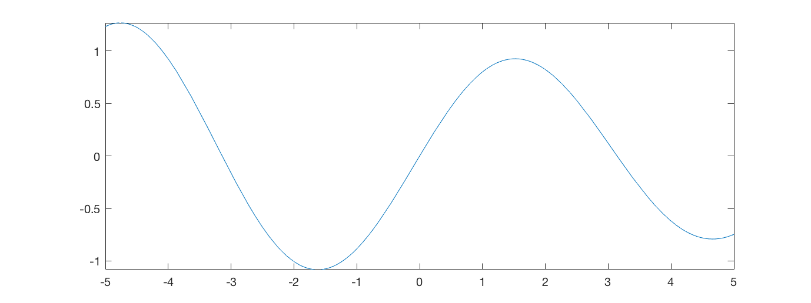

# Numerik mit MATLAB
Hans W Borchers<br />DHBW Mannheim<br />Fakultät für Maschinenbau  
Skript zum Kurs, WS 2016  
<hr>
# Programmierung in MATLAB

## Kontrollstrukturen

Die wichtigen Kontroll- und Steuerelemente von MATLAB sind if-Aweisungen, `if ... else ...end`, for-Schleifen `for ... end` und while-Schleifen `while ... end`.

Das prinzipielle Aussehen einer **if-Anweisung** lautet wie folgt:

    if x > 0
        y = sqrt(x)
    end

`if` und `end` umgreifen Bedingung und Anweisung. Falls die Bedingung wahr ist, wird die Anweisung durchgeführt. Mit `elseif` lassen sich in die if-else-Schleife weitere Bedingungen einfügen; es kann mehr als ein `elseif` geben. Die if-Schleife wird mit `else` erweitert: Die Anweisungen nach `else` werden dann ausgeführt, wenn die vorherigen Bedingungen nicht erfüllt sind.

    if x > 0
        y = sqrt(x);
    elseif x == 0
        y = 0;
    else
        y = NaN;
    end

Mit der **for-Schleife** kann eine Abfolge von Befehlen mit 'Laufindex'
automatisiert werden. Das prinzipielle Aussehen ist `for` gefolgt von 'variable=ausdruck', dann auszuführende Anweisungen und `end`.

Man beachte, dass am Ende jeder Zuweisung ein Semikolon `;`  stehen sollte, damit unerwünschte Zwischenergebnisse nicht im *Command Window* erscheinen. Das ist besonders wichtig in Schleifen, wenn solche Ausgaben immer wieder in der Ausgabe erscheinen würden.

**Beispiel**: Berechne die ersten 20 Glieder der *rekursiv* definierten Folge $a_n$ mit Startwert $a_1 = 0$ und Rechenvorschrift $a_{n+1}=a_n^2+1/4$.

    >> a = zeros(1, 20);        % a(1) ist schon 0.0
    >> for i = 2:20
         a(i) = a(i-1)^2 + 0.25;
       end
    >> a
    a =
      Columns 1 through 8
             0    0.2500    0.3125    0.3477    0.3709    0.3875    0.4002        0.4102
      Columns 9 through 16
        0.4182    0.4249    0.4305    0.4354    0.4395    0.4432    0.4464        0.4493
      Columns 17 through 20
        0.4519    0.4542    0.4563    0.4582

**Aufgabe**: Gegen welchen Grenzwert konvergiert die Folge $(a_n)$?

**Beispiel**: Eine *Hilbert*-Matrix $H = (h_{ij})$ hat folgende Einträge:  $h_{ij} = 1/(i+j-1)$. Man kann eine Hilbert-Matrix der Grösse $(5 \times5)$ zum Beispiel erzeugen durch zwei ineinander geschachtelte for-Schleifen.

    >> H = zeros(5, 5)
    >> for i = 1:5
         for j = 1:5
           H(i, j) = 1/(i+j-1);
         end
       end
    >> H
    H =
        1.0000    0.5000    0.3333    0.2500    0.2000
        0.5000    0.3333    0.2500    0.2000    0.1667
        0.3333    0.2500    0.2000    0.1667    0.1429
        0.2500    0.2000    0.1667    0.1429    0.1250
        0.2000    0.1667    0.1429    0.1250    0.1111

Natürlich ist das nicht auf zwei ineinander geschachtelte for-Schleifen beschränkt. Nebenbei gesagt gibt es die Funktion `hilb(5)`, welche genau diese Matrix zurück gibt.

Das prinzipielle Aussehen einer **while-Schleife** lautet wie folgt: Auf `while` folgt eine Bedingung, die geprüft wird, danach Anweisungen, die ausgeführt werden sollen und `end`. Im Gegensatz zur for-Schleife wird die Anzahl der gewünschten der Iterationen nicht vorgegeben; stattdessen wird iteriert, solange die Bedingung wahr ist.

**Beispiel**: Bekanntlich divergiert die harmonische Reihe, also
$1 + 1/2 + 1/3 + ...$. Es gibt also ein $n$, so dass $1 + 1/2 + 1/3 + ... + 1/n > 10$. Wir addieren diese kleiner werdenden Brüche solange, bis die Summe größer als 10 wird und geben die Anzahl der Summanden aus.

    >> s = 0;
    >> n = 0;
    >> while s <= 10.0
         n = n + 1;
         s = s + 1/n;
       end
    >> n
    n =
           12367

Die Divergenz der harmonischen Reihe ist sehr langsam.

Die Schleifen-Konstrukte `for` und `while` können vorzeitig verlassen werden; dazu gibt es die Schlüsselworte `break` und `continue`. Die `break` Anweisung ist eine Sprunganweisung und dient dazu, aus einer Schleife herauszuspringen. Die Programmausführung wird unmittelbar hinter der Schleife fortgeführt (hinter dem `end`, das zu dieser Schleife gehört).

`continue` ist ebenfalls eine Sprunganweisung und bewirkt, dass zur nächsten Iteration einer for- oder while-Schleife übergegangen wird. Innerhalb der Schleife folgende Anweisungen werden nicht mehr ausgeführt.


## Skripte

Ein Skript enthält eine Folge von MATLAB Anweisungen, die inhaltlich zusammengehören und in einer Datei mit der Dateierweiterung (engl. *extension*) '.m' abgespeichert werden. Die Datei muss im Suchpfad von MATLAB liegen, zum Beispiel im *Current Folder* Fenster sichtbar sein.

Die Anweisungen werden ausgeführt, wenn man den Dateinamen (ohne `.m` Erweiterung) im *Command Window* eingibt. Die Variablen in einem Skript sind *global*, das heisst sie sind im *Command Window* verfügbar. Umgekehrt kennt ein Skript alle Variablen alle Variablen, die in MATLAB bereits definiert wurden (und im *Workspace* sichtbar sind).

**Beispiel**: Wir wollen für alle Zahlen von 1 bis 1000 das sogenannte "(3n+1)-Problem" (auch Collatz-Vermutung) durchrechnen.

>   Beginne mit irgendeiner natürlichen Zahl n > 0.
    Ist n gerade, so nimm als nächstes n/2.
    Ist n ungerade, so nimm als nächstes 3n + 1.
    Wiederhole die Vorgehensweise mit der erhaltenen Zahl
    bis die Zahl 1 erreicht wird.

Beginnen wir mit $n = 17$, dann entsteht die Folge $(17, 52, 26, 13, 40, 20, 10, 5, 16, 8, 4, 2, 1)$ der Länge 13 (mit 12 Schritten) und mit höchster Zahl 52. Bei 1 wird abgebrochen, weil sich die Folge sonst mit $(1, 4, 2, 1, ...)$ unendlich wiederholen würde.

Es ist eine mathematische Vermutung, dass für jeden Startwert $n$ die Folge nach endlich vielen Schritten mit 1 endet. Diese Vermutung ist unbewiesen.

Wir wollen ein Skript erstellen, dass mit einer Zahl $n$ beginnt und die entstehende Folge ausrechnet. Dazu erstellen wir im Editor eine Datei "collatz.m":

```matlab
    n = 17;
    if mod(n, 2) == 0
        n = n / 2;
    else
        n = 3*n + 1;
    end
    n
```

Die MATLAB Funktion `mod(n, m)` bestimmt den Rest bei der ganzzahligen Division von `n` durch `m`. Daher ist `mod(n, 2)` gleich 0, wenn `n` gerade ist und sonst 1. `mod(n, 2) == 0` also wahr genau dann wenn `n` gerade ist. In diesem Fall wird der erste Zweig der *if*-Anweisung ausgeführt (also `n=n/2`), sonst der zweite (`n=3*n+1`).

Führen wir das im *Command Window* aus, erhalten wir das erwartete Ergebnis.

    >> collatz
    n =
        52

Das Ziel ist, diese Folge fortzusetzen, bis $n=1$ erreicht wird. Dazu bietet sich eine `while`-Schleife an. Die Syntax ist wieder ganz einfach.

```matlab
    n = 17;
    while n > 1
    if mod(n, 2) == 0
        n = n / 2;
    else
        n = 3*n + 1;
    end
    end
    n
```

Da die `while`-Schleife nachträglich hinzugefügt wurde, stimmt die Einrückung der Befehle nicht. Auswählen aller Zeilen zwischen `while` und (seinem) `end` und Drücken der <TAB> Taste rückt diese Zeilen ein.

Es soll aber auch die Anzahl der Schritte und die grösste in der Folge auftretende Zahl ermittelt werden, also fügen wir noch zwei Variablen `anz_schritte` und `max_n` ein und berücksichtigen sie in jedem Schritt: `anz_schritte` wird um 1 erhöht und `max_n` ggf. vergrössert.

```matlab
    n = 17;
    max_n = n;
    anz_schritte = 0;
    while n > 1
        anz_schritte = anz_schritte + 1;
        if mod(n, 2) == 0
            n = n / 2;
        else
            n = 3*n + 1;
        end
        if n > max_n
            max_n = n;
        end
    end
    n, anz_schritte, max_n
```

Beachten Sie, dass wir uns in der `while`-Schleife darauf verlassen, dass die Collatz-Vermutung stimmt und irgendwann 1 erreicht wird, andernfalls laufen wir in eine unendliche Schleife -- die man in MATLAB mit >CTRL>-C abbrechen müsste.

    >> collatz
    n =
         1
    anz_schritte =
        12
    max_n =
        52

Wir wollen für alle Zahlen $n=1$ bis 1000 diese Rechnung durchführen und uns für jedes $n$ das Maximum und die Anzahl der Schritte merken. Dazu bietet sich eine Matrix an mit 1000 Zeilen und 3 Spalten.

Als Kontrollstruktur werden wir eine `for`-Schleife benutzen, wobei mit `for i = 1:N` bis `end` für jedes $i=1,...,1000$ die Anweisungen dazwischen ausgeführt werden. Wir benutzen noch `N = 1000` als Konstante, um den Bereich, in dem wir die Rechnungen ausführen, leichter verändern zu können.

```matlab
    N = 1000;
    for i = 1:N
        n = i;
        max_n = n;
        anz_schritte = 0;
        while n > 1
            anz_schritte = anz_schritte + 1;
            if mod(n, 2) == 0
                n = n / 2;
            else
                n = 3*n + 1;
            end
            if n > max_n
                max_n = n;
            end
        end
        R(i, :) = [i, anz_schritte, max_n];
    end
```

Wenn dieses Skript ausgeführt wird, erscheint kein Ergebnis, aber die Matrix `R` ist vorhanden und kann angezeigt werden.

    >> collatz
    >> R(1:10, :)
    ans =
         1    0    1
         2    1    2
         3    7   16
         4    2    4
         5    5   16
         6    8   16
         7   16   52
         8    3    8
         9   19   52
        10    6   16

Mit `max(R)` werden die Maxima aller drei Spalten angezeigt.

    >> max(R)
    ans =
            1000      178   250504

**Aufgabe**: Für welche Zahlen $n$ ist die Anzahl der Schritte grösser oder gleich 170? Für welche $n$ ist 250504 die grösste erreichte Zahl.

Für mehr Flexibilität in der Wahl von `N` kann man die Zeile `N = 1000` ersetzen durch `if ~exist('N'), N = 1000; end`. Dann kann N in MATLAB gesetzt werden, das Skript erkennt, dass diese Variable einen Wert besitzt und benutzt diesen.

    >> N = 10000;
    >> collatz
    >> max(R)
    ans =
           10000        261   27114424

**Aufgabe**: Erzeuge einen Plot der Anzahl Schritte für $n$ von 1 bis 10000.


## Benutzerdefinierte Funktionen

In den meisten Anwendungen muss der Benutzer seine eigenen Funktionen aufstellen können, um Probleme zu lösen. Für ganz kleine Funktionen, die in einer Zeile geschrieben werden können, gibt es die Möglichkeit sogenannter "anonymer" Funktionen, mit 'Klammeraffe' `@` (engl. *at-sign*) und Klammern für die Angabe der Argumente.

    >> fun1 = @(x) exp(-0.05 * x) .* sin(x);

Mit `fplot` lässt sich die Funktion einfach plotten und stellt offenbar eine gedämpfte Schwingung dar.

    >> fplot(@(x) exp(-0.05 * x) .* sin(x))     % oder fplot(fun1)



Der Benutzer kann aber auch eigene, kompliziertere Funktionen schreiben und damit die Funktionalität von MATLAB deutlich zu erweitern. Alle diese Funktionen, und auch die MATLAB-internen Funktionen, sind in Funktionsdateien abgelegt, und zwar pro Funktion *eine* Datei. Der Name der Datei muss mit dem Namen der Funktion übereinstimmen, ergänzt um die Erweiterung '.m'.

Die Syntax zur Definition einer Funktion ist genau vorgeschrieben. ie erste (ausführbare) Zeile muss die Form "function rückgabewert = (argumente)" haben, die ganze Funktion kann (muss aber nicht) mit einem `end` beendet werden. Innerhalb dieses Rahmens können alle MATLAB Befehle benutzt werden.

Die obige Funktion unter dem Namen 'fun1' und geschrieben in einer Funktionsdatei "fun1.m" wird folgendermassen aussehen:

```matlab
    function y = fun1(x)
    y = exp(-0.05 * x) .* sin(x);
    end
```

Wichtig: Vergessen Sie nicht, im Editor die Datei zu speichern! Der Name der Datei muss links im *Current Folder* Fenster zu sehen sein.

Im *Command Window* oder in einer anderen Funktion kann "fun1" aufgerufen wie eine interne MATLAB FUnktion. Da `.*` für die Multiplikation benutzt wird, ist diese Funktion sogar vektorisiert.

    >> x = linspace(0, 2*pi, 5);
    >> y = fun1(x);
    >> y
    y =
         0    0.9245    0.0000   -0.7901   -0.0000

Variablen in Functionsdateien sind lokale Variablen, die in der globalen Umgebung (engl. *scope*) des *Command Windows* nicht bekannt sind. Die Übergabe einzelner Variablen erfolgt über die Parameterliste im Funktionsaufruf. Werte können an die aufrufende Funktion nur über Parameter zurückgegeben werden.

Beim Versuch, diese Funktion mit `fplot` zu plotten, gibt es eine Fehlermeldung:

    >> fplot(fx23)
    Not enough input arguments.
    Error in fx23 (line 2)
    x2 = x.^2;

Diese Meldung ist unverständlich. Tatsächlich erkennt MATLAB `fx23` nicht als Funktion, ebenso wie es `sin` nicht erkennen wird. Um MATLAB zu zwingen, dies als Funktion zu erkennen, wird der Klammeraffe `@` verwendet.

    >> fplot(@fx23)

Dies wird den gleichen Plot erzeugen wie oben mit `fplot(fun1)`.

Wichtig: `@` wird für alle Funktionen benötigt, die in Dateien definiert werden, u.a. für alle MATLAB-internen Funktionen. Es darf nicht benutzt werden für anonyme Funktionen (die schon mit `@` definiert werden).

Funktionen können Vektoren oder Matrizen zurückgeben, aber auch mehrfache Werte. Die folgende Funktion `fx23` berechnet das Quadrat und die dritte Potenz des Argumentes:

```matlab
    function [x2, x3] = fx23(x)
    x2 = x.^2;
    x3 = x.^3;
    end
```

Um aus dieser Funktion beide Werte zu erhalten, muss die Funktion in der Form `[y1, y2] = fx23(x)` aufgerufen werden, sonst wird nur ein Wert zurückgegeben.

    >> y1 = fx23(1.5)
    y1 =
        2.2500
    >> [y1, y2] = fx23(1.5)
    y1 =
        2.2500
    y2 =
        3.3750

**Aufgabe**: Implementiere die folgende Funktion, die offenbar eine if-Anweisung erfordert und nicht ohne weiteres als einzeilige Funktion geschrieben werden kann.

$$
  \mathrm{myabs}(x) = \left\{
    \begin{array}{rl}
     0   & \textrm{für } x < 0 \\
     x   & \textrm{für } x \ge 1
    \end{array} \right.
$$

**Aufgabe**: Ist ihre Version der Funktion vektorisiert? Wie kann man diese Funktion so implementieren, dass sie vektorisiert ist?

**Beispiel** Ziel ist es eine Funktion `wurzel(a, n)` zu schreiben, die für $x >= 0$ die $n$-te Wurzel von $a$ berechnet.

Gesucht ist eine Nullstelle der Funktion $f(x) = x^n - a$. Dem Newtonschen Verfahren gemäss wird eine Iteration
$$
  x_{i+1} = x_i - \frac{f(x_i)}{f'(x_i)} = x_i - \frac{x_i^n - a}{n x_i^{n-1}} =
  \frac{1}{n} ((n-1)x_i + \frac{a}{x_i^{n-1}})
$$
mit beliebigem Startwert $x_1 > 0$.

```matlab
    function y = wurzel(a, n)
    x = 1.0;
    y = 1/n * ((n-1)*x + a/x^(n-1));
    while (abs(y-x) > 1e-15)
        x = y;
        y = 1/n * ((n-1)*x + a/x^(n-1));
    end
    end
```

Da die $n$-te Wurzel für $a < 0$ nicht existiert, sollte in diesen Fall eine Fehlermeldung ausgegeben werden. Dafür gibt es den Befehl `error`, der mit einer geeigneten Meldung zu versehen ist, innerhalb einer `if`-Abfrage:

```matlab```
if a < 0
    error('Argument a muss eine Zahl grösser Null sein.')
end
```

Wenn $a = 0$ oder $a = 1$ ist, sollte keine Berechnung durchgeführt werden, da das Ergebnis bekannt ist. Der Befehl `return` ermöglicht es, die Funktion *sofort* zu verlassen, die folgenden Befehle werden nicht mehr ausgeführt. Den Rückgabewerten müssen aber vorher Werte zugewiesen werden.

```matlab```
if a == 0 || a == 1
    y = a;
    return
end
```

Dabei bezeichnet der `||` Operator eine logische *oder*-Verknüpfung, entsprechend würde `&&` eine logische *und*-Verknüpfung bezeichnen.

Die Funktion soll weiterhin auch in der Form `wurzel(a)` aufgerufen werden können, in diesem Fall soll automatisch $n = 2$ gesetzt, also die Quadratwurzel bestimmt werden. Dafür gibt es in MATLAB die Variable `nargin`, die bei jedem Aufruf einer Funktion definiert ist und die Anzahl der mitgegebenen Argumente beinhaltet.

Für `wurzel(a, n)` ist `nargin` 2, für `wurzel(a)` nur 1. Daher setzt der folgende Code einen Fehlwert für `n`. Für einen Aufruf `wurzel()` oder nur `wurzel` wird MATLAB weiterhin eine eigene Fehlermeldung zeigen.

```matlab```
if nargin < 2
    n = 2;
end
```

Übrigens gibt es auch eine Variable `nargout`, welche die beim Aufruf angeforderten Rückgabewerte zählt.

Insgesamt sieht die `wurzel`-Funktion jetzt folgendermassen aus:

```matlab
    function y = wurzel(a, n)
    if a < 0
        error('Argument a muss eine Zahl grösser Null sein.')
    end
    if a == 0 || a == 1
        y = a;
        return
    end
    if nargin < 2
        n = 2;
    end
    %-- Beginn der Berechnung ---
    x = 1.0;
    y = 1/n * ((n-1)*x + a/x^(n-1));
    while (abs(y-x) > 1e-15)
        x = y;
        y = 1/n * ((n-1)*x + a/x^(n-1));
    end
    end
```

**Aufgabe**: Füge einen weiteren Rückgabewert `e` ein, der die Anzahl der Schritte mitzählt und beim Aufruf `[w, e] = wurzel(a, n)` diese Zahl der benötigten Schritte anzeigt.

    >> [w, e] = wurzel(1.20/0.05, 60)  % 60-te Wurzel von 24
    w = 1.0544
    e = 23

**Beispiel**: Die Funktion `bits(a)` soll für eine Zahl $a$ zwischen 0 und 1 die binäre Darstellung (im Zweiersystem) als Zeichenkette zurückgeben, und zwar auf 53 Stellen, so wie sie im Computer abgespeichert werden.

Ist also $0 < a < 1$, dann ergibt sich die Darstellung im Zweiersystem zu
$$
  a = 0 + \frac{b_1}{2^1} + \frac{b_2}{2^2} + ... + 
          \frac{b_{53}}{2^{53}} + ...
$$

wobei $b_i$ gleich 0 oder 1 ist für alle $i$.

Prüfen Sie nach, dass die folgende Rechnung korrekt ist.

```matlab
function b = bits(a)
if a <= 0 || a >= 1
    error('Argument a muss zwischen 0 und 1 liegen.')
end
b = '0.';
for i = 1:53
    if a >= 1/2^i
        a = a - 1/2^i;
        b = [b, '1'];
    else
        b = [b, '0'];
    end
    if a == 0
        break
    end
end
```

Dabei bedeutet `['Hello ', 'World']` dass zwei Zeichenkette zu einer zusammengefügt, also hintereinander geschrieben werden: 'Hello World'.

    >> bits(1/2 + 1/8 + 1/16)
    ans = 
    0.1011
    >> bits(0.2)
    ans = 
    0.00110011001100110011001100110011001100110011001100110

**Aufgabe**: Schreibe eine Funktion `bits3`, welche die *ternäre* Darstellung (im Dreiersystem) einer Zahl $0 < a < 1$ erzeugt, mit den Ziffern '0', '1', und '2'.

**Aufgabe**: Erstellen Sie eine Funktion `agm(a, b)`, welche für zwei Zahlen $a$ und $b$ das **algebraisch-geometrische Mittel* berechnet.
